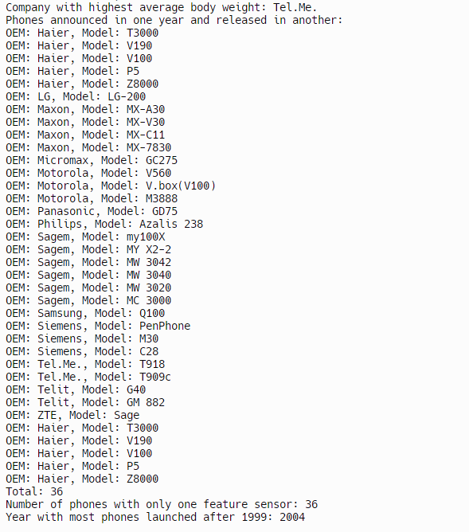

Programming Language and Version:
Java (OpenJDK) version 17.0.5 with GraalVM CE 22.3.0.

Reason for Choosing Java:
Java was chosen for its widespread use, strong community support, and versatility. It's a popular choice for enterprise-level applications, web development, Android app development, and more. Additionally, Java's object-oriented nature, platform independence, and robust standard library make it suitable for a wide range of projects.

Handling of Programming Constructs in Java:
Object-Oriented Programming: Java is built around object-oriented principles, supporting classes, objects, inheritance, polymorphism, and encapsulation.
File Ingestion: Java provides robust file handling capabilities through classes like File, BufferedReader, FileReader, etc.
Conditional Statements: Java supports conditional statements such as if, else, switch, and case.
Assignment Statements: Java allows assignment statements using the = operator.
Loops: Java supports loops including for, while, and do-while loops for iterative control flow.
Subprograms (Functions/Methods): Java utilizes methods for code modularity and reusability, enabling the creation of reusable code blocks.
Unit Testing: Java has built-in support for unit testing through frameworks like JUnit, which facilitates writing and executing tests to ensure code quality.
Exception Handling: Java provides robust exception handling mechanisms using try, catch, finally, and throw keywords.

Libraries Used:
JUnit: JUnit is a popular unit testing framework for Java. I chose it for its simplicity and effectiveness in writing and executing unit tests for my Java code.
Stream API: The Stream API in Java provides functional-style operations for processing sequences of elements. I used it for data manipulation and filtering in my application.
BufferedReader: BufferedReader is a class in Java used to read text from a character-input stream. I used it for efficient file reading and ingestion in my application.

